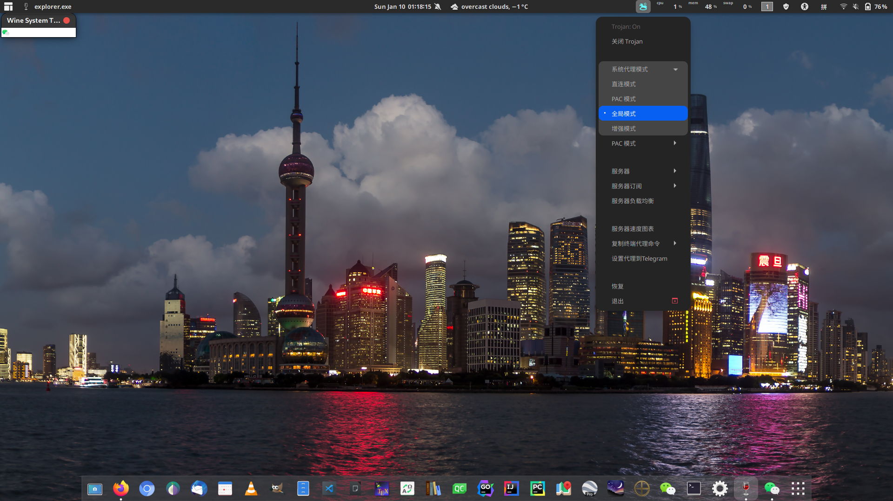
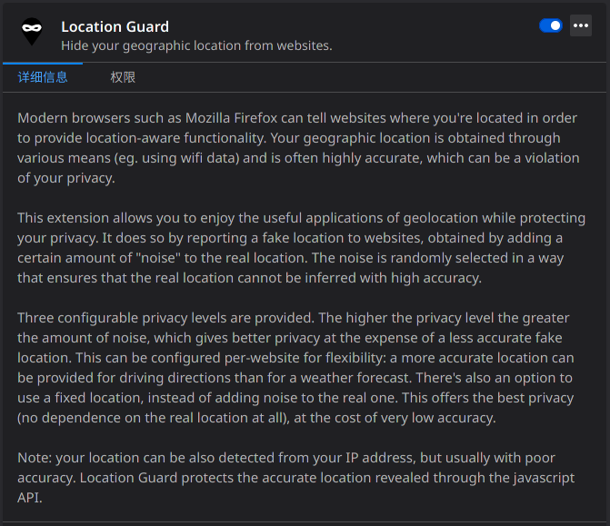
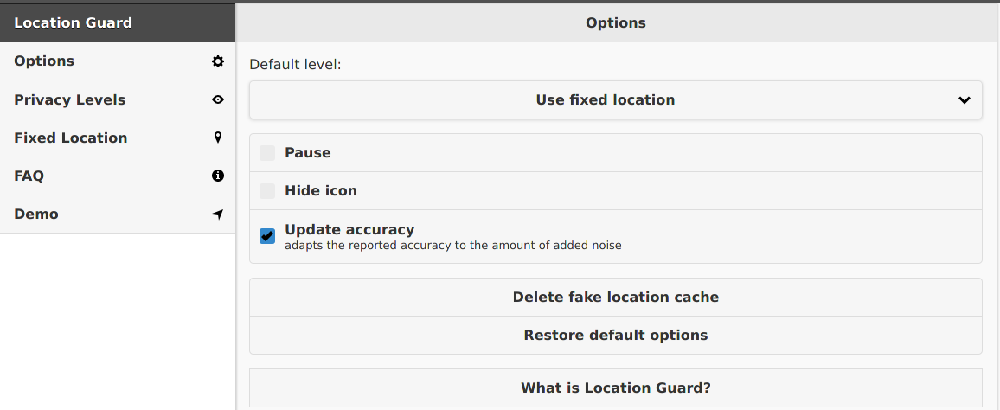
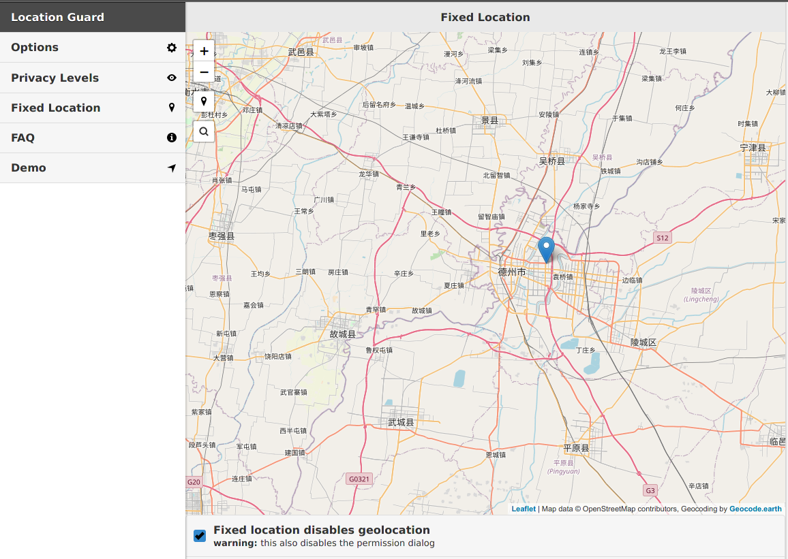

# 平安复旦打卡
我分享给大家一个tricky——在平安复旦每日打卡填入任意想要的地址。

最近填平安复旦，我意识到现有自动打卡机只能填入跟昨天一样的地址，这很不舒服。事实上，这个位置可以任意指定。这只是分享给大家的一个漏洞，请勿作恶！

**平安复旦定位会先通过IP，再通过浏览器cache。**

首先是“所在地点”单选框，如果发起定位的IP地址跟你选的吻合，就能直接通过网络定位了；如果不匹配，系统会去拿浏览器cache，如果cache匹配“所在地点”，那么定位能成功地被修改；当然，如果cache也不匹配，那就不能成功提交定位了。

平安复旦任意定位的思路很简单：<u>挂全局代理改变发起定位请求的IP使它不在中国大陆；篡改cache使cache的位置在中国大陆即可，我们只需要把浏览器cache缓存的定位篡改到任意想要的位置就可以</u>

全局代理不说了，例如挂到美国，这时候IP就不是大陆IP了；

> 我们Linux实在是太美了！🙂

然后借助插件篡改浏览器cache，这个插件在 firefox 叫做 `Location Guard`

打开之后配置成 `Fixed location`，接着在 `Fixed location` 找一个你想要的地址就可以。

比如我去了美丽的德州……

最后去平安复旦定位就行了，记得打开定位权限，这样平安复旦才能读浏览器cache。

我现在在山东德州打德州，你们呢？

众所周知，德州扑克起源于山东德州而不是美国德州。

**敬自由**
