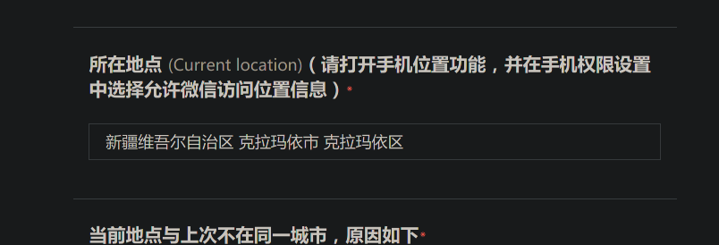

# 平安复旦打卡
分享给大家一个tricky，关于平安复旦打卡，填入任何你想要的地址

这是我在国庆节准备不假离校预案的时候发现的，最近填平安复旦意识到现有的自动打卡机只能填入跟昨天一样的地址，这很不舒服，其实这个位置可以任意指定。这样理论上不请假跨省移动也可以有效地规避审查，不过只是理论，这只能算是分享给大家一个漏洞

**平安复旦定位会先通过IP，再通过cache**

这个方法要在浏览器搞...

首先是这个单选框，如果发起定位的IP地址跟你选的吻合，就能直接通过网络定位了；如果不匹配，系统才会去拿cache，如果cache匹配这个单选框，就成功了；当然，如果cache也不匹配，那就是彻底不匹配了。

平安复旦任意定位的思路很简单：<u>挂全局代理改变发起定位请求的IP使它不在中国大陆；篡改cache使cache的位置在中国大陆即可，我们只需要把浏览器cache缓存的定位篡改到任意想要的位置就可以</u>

全局代理不说了，例如挂到美国，这时候IP就不是大陆IP了；

> 我们的 Linux 实在是太美了！🙂

然后借助插件该浏览器cache，这个插件在 firefox 叫做 `location guard`

打开之后配置成 `fixed location`，然后在 `fixed location` 找一个你想要的地址就可以。

比如我去了美丽的德州

然后去平安复旦定位就行了，记得打开定位权限，这样平安复旦才能读浏览器cache

我现在在克拉玛依旅游，你们呢？

**希望帮助大家规避审查，实现真正的自由**